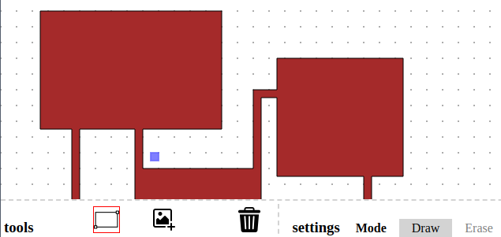

Hack-A-Blueprint is a tool to draw house floorplans and blueprints.

A demo can be [seen here](https://za3k.github.io/ha3k-13-blueprint/).

It was made in one day by za3k as part of [hack-a-day](https://za3k.com/hackaday).

Features:

- Draw a house using rectangles (or polygons). Shapes automatically merge.
- Automatic grid snap
- "Erase" mode, which instead deletes rectangles (or polygons)
- Place premade icon "stickers" including: doors, windows, outlets, and common appliances.
- Add and edit text. Style with fonts and sizes.
- Pan and zoom
- Autosave
- Share a link

Feature wish list:

 - [ ] Show room measurements automatically (or add measurement tool)

Credits:
- Heavy inspiration (but no graphics or code) came from the D&D map editor, <a href="https://ww.dungeonscrawl.com">dungeon scrawl</a>.
- Icons by [Creaticca Creative Agency - Flaticon]("https://www.flaticon.com/free-icons/save") as part of the "Graphic design tools" icon pack.
- Various other icons from Flaticon (sorry, I forgot!)
- Fonts
    - [Permanent Marker](https://fonts.google.com/specimen/Permanent+Marker) by Font Diner. Apache license.
